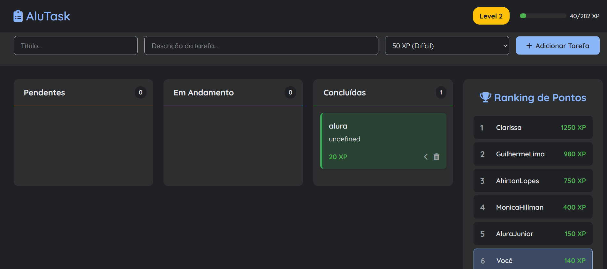

# 📋 AluTask



> Sistema de gerenciamento de tarefas gamificado desenvolvido durante a Imersão Dev Alura com Google

## 📌 Sobre o Projeto

AluTask é uma aplicação web de gerenciamento de tarefas que incorpora elementos de gamificação para tornar a organização de atividades mais engajante e motivadora. O sistema permite aos usuários criar, organizar e acompanhar suas tarefas enquanto competem em um ranking de pontos (XP).

## ✨ Funcionalidades

- **Sistema de Tarefas em Kanban**: Organize suas tarefas em três colunas:
  - 🔴 Pendentes
  - 🔵 Em Andamento
  - 🟢 Concluídas

- **Sistema de Gamificação**:
  - Ganhe XP (pontos de experiência) ao completar tarefas
  - Sistema de níveis baseado em pontos acumulados
  - Diferentes níveis de dificuldade para as tarefas (com recompensas variadas)

- **Ranking de Pontos**:
  - Competição amigável entre usuários
  - Visualização em tempo real do ranking
  - Acompanhamento do progresso individual

- **Interface Intuitiva**:
  - Design moderno e responsivo
  - Campos para título e descrição detalhada das tarefas
  - Seleção de nível de dificuldade (XP)
  - Sistema de navegação entre tarefas

## 🚀 Tecnologias Utilizadas

    


## 🎮 Sistema de Pontuação

O sistema oferece diferentes níveis de dificuldade para as tarefas:

- **Fácil**: 20 XP
- **Médio**: 50 XP
- **Difícil**: 100 XP

Ao acumular pontos, você progride através dos níveis, incentivando a conclusão consistente de tarefas.

## 💻 Como Usar

1. **Clone o repositório**
```bash
git clone https://github.com/cissamil/ProjetoAlura.git
cd ProjetoAlura
```

2. **Instale dependências **
```bash
npm install
npm start
http://localhost:3000/
```

## 📝 Licença

Este projeto foi desenvolvido como parte da Imersão Dev Alura com Google e está disponível para fins educacionais.

## 👤 Autor

**Clarissa Eri Morita**

- GitHub: [@cissamil](https://github.com/cissamil)

## 🙏 Agradecimentos

- [Alura](https://www.alura.com.br/) pela Imersão Dev
- Google pelo suporte e tecnologias
- Comunidade da imersão e professores responsáveis

---

⭐ Se este projeto foi útil para você, considere dar uma estrela no repositório!
